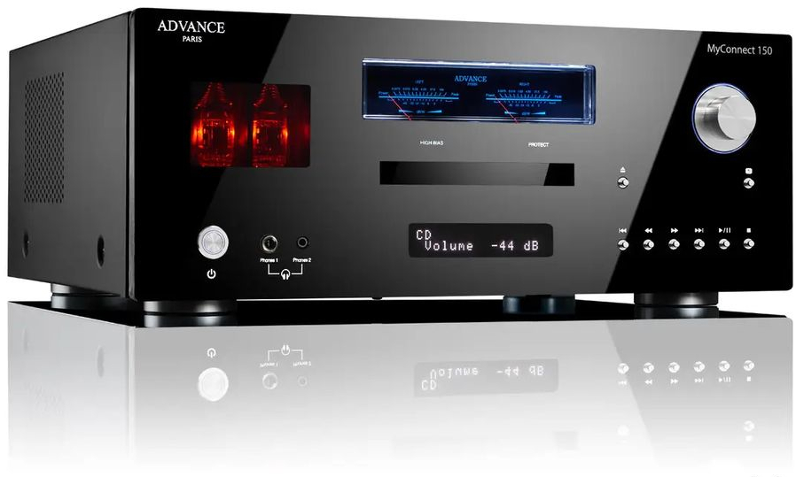

câblage
+++++++

Un ami qui s'est doté d'un système hifi :download:`MyConnect 150 <_static/datasheet/my_connect_150.pdf>` à tube haut de gamme de la marque française **Advance Paris** souhaitait
acheter des câbles pour relier sa merveille à ses enceintes également hauts de gamme.

   My Connect 150 de la société Advance Paris

Comme vous vous en doutez, il ne souhaite pas que les câbles audio dégradent la qualité sonore et donc son expérience
musciale.

Il me demande donc un petit coup de main pour choisir les câbles idoines à son besoin. Je commence à effectuer 
une recherche sur différents sites web dédiés au monde audio haut de gamme. Et là, j'avoue je tombe sur des argumentaires
techniques qui sont complétement ubuesques. Le seul objectif est de promouvoir des câbles extrémement cher, sachant que
la marge économique sur de tel type de câbles sont collosales.

Je vous propose donc une analyse des arguments courants données par les sites audio sur l'achat de câble.

.. epigraph::
   "Ne sous-estimez jamais l’importance du câble HP sous peine de 
   brider vos enceintes et par la même occasion le reste de votre système. Il peut en effet 
   présenter une signature sonore très différente en fonction des matériaux utilisés pour 
   la confection de ses conducteurs. Par exemple, l’argent et le cuivre offrent des sonorités 
   différentes. L’argent favorise l’aigu, tandis que le cuivre apporte davantage de 
   profondeur au grave/médium. Il existe toutefois des câbles bi-métaux permettant d’obtenir
   un bon compromis. Les plus exigeants opteront pour un amplificateur autorisant le 
   bi-câblage pour mélanger différents types de câbles."

   -- cobra.fr

`Comment bien choisir son câble pour enceinte selon le site cobra.fr <https://www.cobra.fr/comment-bien-choisir-son-cable-pour-enceinte-p-43964>`_

