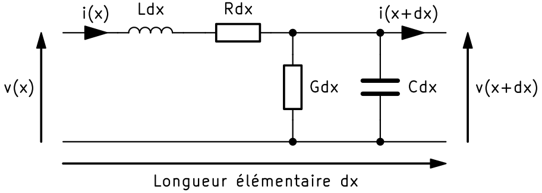
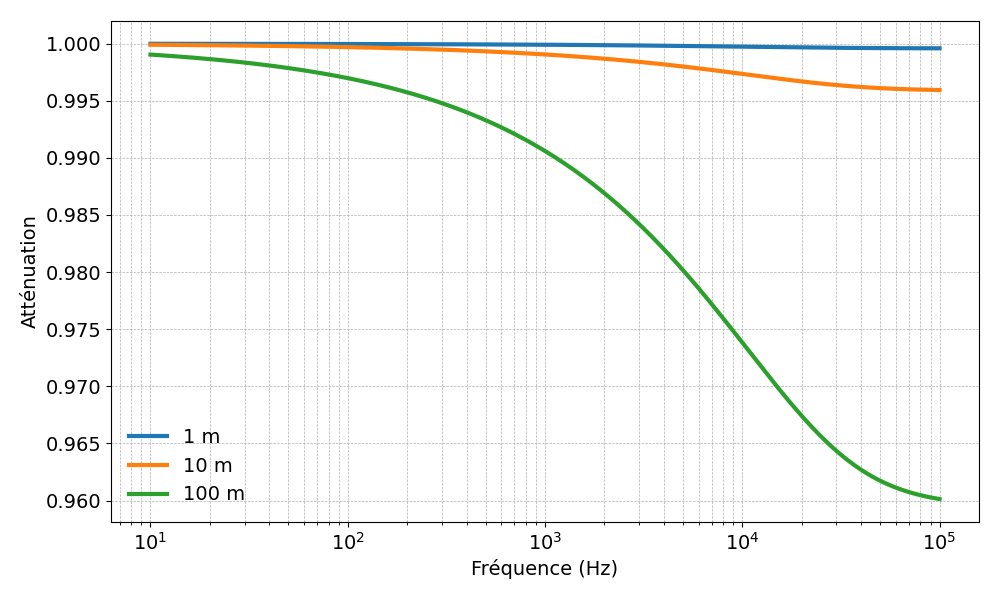

Etude des lignes de propagation
===============================

Théorie de l'équation des télégraphistes
========================================

Les équations des télégraphistes sont les équations régissant la transmission le long d'une ligne électrique.

L'origine des équations des télégraphistes
------------------------------------------

Ces équations ont vu le jour à la fin du XIXe siècle, à une époque où les télégraphes électriques étaient en 
plein essor. Les ingénieurs de l'époque cherchaient à comprendre et à améliorer la transmission des signaux 
électriques sur de longues distances. C'est dans ce contexte qu'Oliver Heaviside, un ingénieur et physicien 
britannique, a développé un modèle mathématique pour décrire le comportement des lignes électriques. Ce modèle 
a abouti aux équations qui portent désormais son nom.

À quoi servent les équations des télégraphistes ?
-------------------------------------------------

Ces équations permettent de décrire l'évolution de la tension et du courant le long d'une ligne électrique en 
fonction du temps et de la distance. Elles sont indépendantes du type de la ligne à l'instar d'une liaison bifilaire,
câble coaxial ou d'un guide d'onde. 

Elles prennent en compte les différents paramètres de la ligne, tels que :

* La résistance linéique en série :math:`R` en :math:`\Omega` par unité de longueur : traduit la dissipation d'énergie sous forme de chaleur (perte dans le conducteur).
* L'inductance linéique en série :math:`L` en :math:`H` par unité de longueur : liée à la création d'un champ magnétique autour du conducteur (perte dans le diélectrique).
* La capacitance linéique en parallèle :math:`C` en :math:`F` par unité de longueur : due à la présence d'un champ électrique entre les conducteurs (perte dans le diélectrique).
* La conductance linéique en parallèle :math:`G` en :math:`S` par unité de longueur : qui représente les pertes par courants de fuite dans l'isolant (perte dans le conducteur).

Soient :math:`v(x, t)` la tension et :math:`i(x, t)` le courant en un point éloigné d'une distance :math:`x` 
du début de la ligne à un instant :math:`t`, deux équations aux dérivées partielles relient ces grandeurs :

.. math::

    \frac{\partial U}{\partial x}(x,t)=-L\frac{\partial I}{\partial t}(x,t)-RI(x,t)

.. math::

    \frac{\partial I}{\partial x}(x,t)=-C\frac{\partial U}{\partial t}(x,t)-GU(x,t)

En réalisant des combinaisons et dérivations de ses relations, les équations du télégraphistes sont obtenues :

.. math::

   \frac{\partial^2 v(x, t)}{\partial x^2} = LC \frac{\partial^2 v(x, t)}{\partial t^2} + (R + G)\frac{\partial v(x, t)}{\partial t}

.. math::

   \frac{\partial^2 i(x, t)}{\partial x^2} = LC \frac{\partial^2 i(x, t)}{\partial t^2} + (R + G)\frac{\partial i(x, t)}{\partial t}

Etude en régime harmonique 
--------------------------

L'étude en régime harmonique correspond à l'analyse d'un signal périodique 
comme une somme de fonctions sinusoïdales (ondes pures) de différentes fréquences, amplitudes et phases. 
Cela la rend particulièrement utile pour analyser et comprendre le son, qui est une onde périodique 
ou quasi-périodique.

Le passage en mode harmonique des équations du télégraphistes repose sur l'utilisation de l'opérateur :math:`j\omega` (:math:`\omega = 2 \pi f`)  comme 
équivalent de :math:`\frac{d}{dt}` dans le domaine fréquentiel.

La fonction de transfert ainsi obtenue qui décrit la relation entre la tension d'entrée 
et la tension de sortie en fonction de la distance :math:`l` est la suivante :

.. math::

    H(f, l) = e^{-\gamma l},

où :math:`γ` est la constante de propagation complexe définie par :

.. math::

    \gamma = \sqrt{(R + j\omega L)(G + j\omega C)}.

.. hint::

    La notion de constante de propagation est **vraie** en basse fréquence 1 MHz, cependant lorsque dépasse
    cette fréquence, les paramètres R, L, C et G deviennent dépendant de la fréquence.

Modélisation d'une ligne bifilaire non torsadé
==============================================

Les paramètres électriques par unité de longueur (résistance :math:`R`, inductance :math:`L`, capacité :math:`C`,
et conductance :math:`G`) pour un câble bifilaire non torsadé dépendent de la géométrie du câble, de 
la distance entre les conducteurs, de leur diamètre et des propriétés des matériaux.

Inductance par unité de longueur
--------------------------------

L'inductance dépend de la distance :math:`d` entre les conducteurs et de leur rayon :math:`a`. Elle peut 
être approximée par :

.. math::

    L \approx \frac{\mu_0}{\pi} \ln\left(\frac{d}{a}\right),

où :

- :math:`\mu_0 \approx 4\pi \times 10^{-7} \, \text{H/m}` est la perméabilité du vide,
- :math:`d` est la distance entre les axes des conducteurs,
- :math:`a` est le rayon des conducteurs.

Capacité par unité de longueur
------------------------------

La capacité dépend des mêmes paramètres et est donnée par :

.. math::

    C \approx \frac{\pi \epsilon_0}{\ln\left(\frac{d}{a}\right)},

où :

- :math:`\epsilon_0 \approx 8.85 \times 10^{-12} \, \text{F/m}` est la permittivité du vide.

Résistance par unité de longueur
--------------------------------

La résistance est déterminée par la résistivité :math:`\rho` du matériau conducteur et le rayon :math:`a` des fils :

.. math::

    R = \frac{\rho}{\pi a^2},

où :

- :math:`\rho \approx 1.68 \times 10^{-8} \, \Omega \cdot \text{m}` pour le cuivre.

Conductance par unité de longueur
---------------------------------

La conductance est généralement faible et peut être négligée pour un câble isolé dans l'air ou sous une gaine isolante. Elle dépend du type et de l'épaisseur de l'isolant :

.. math::

    G \approx \frac{\omega \epsilon''}{\ln\left(\frac{d}{a}\right)},

où :math:`\epsilon''` est la partie imaginaire de la permittivité du matériau isolant.

Etude du cas concret d'une ligne bifilaire non torsadée
=======================================================

Nous allons volontairement prendre une liaison de type bifilaire non torsadée, car ce type de liaison est certainement 
le cablâge le mopins performant, en particulier vis-à-vis d'une liaison coaxiale.

Pour un exemple de câble bifilaire non torsadé avec :

- **Distance entre conducteurs** :math:`d = 1` cm,
- **Diamètre des conducteurs** :math:`2a = 1` mm (soit :math:`a = 0.5` mm),
- **Matériau conducteur** : cuivre.

Les valeurs approximatives des paramètres R, L, C et G sont :

- **Inductance** : :math:`L ≈ 0.46 \, \mu \text{H/m}`,
- **Capacité** : :math:`C ≈ 27 \, \text{pF/m}`,
- **Résistance** : :math:`R ≈ 0.108 \, \Omega/m` à :math:`20^\circ \text{C}`,
- **Conductance** : négligeable en cas d'isolant efficace.

L'obtention de ces paramètres, nous permet de tracer la fonction de transfert :

On constate que l'atténuation d'un câble de 10 mètres 